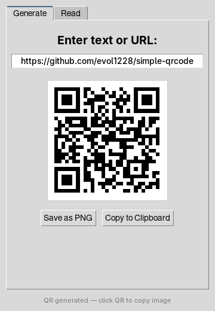

<h1 align="center">Simple QR Code</h1>

<p align="center">
  <strong>A small Windows desktop app that generates QR codes as you type — and reads them back from any image.</strong>
</p>

<p align="center">
  
</p>

---

## What is Simple QR Code?

Simple QR Code is a two-tab desktop tool: the **Generate** tab turns any text or URL into a live QR preview you can save or copy, and the **Read** tab decodes QR codes from image files or straight from your clipboard. Decoding uses OpenCV's built-in QR detector, so there are no system libraries to hunt down.

> **Windows only** — image-to-clipboard copy and `Ctrl+V` paste use the Windows clipboard API (pywin32).

## Features

- **Live generation** — The QR preview updates on every keystroke, no button to press
- **Save as PNG** — Export the code to an image file
- **Copy the image** — Click the QR itself (or the button) to put the image on your clipboard, ready to paste into chats and documents
- **Read from file** — Open a PNG, JPG, BMP, GIF, or WEBP and get the decoded text
- **Paste to read** — Press `Ctrl+V` to decode a screenshot or copied image directly from the clipboard
- **Copy the result** — One click to copy whatever the QR contained

## Requirements

| Dependency    | Install                                         |
|---------------|--------------------------------------------------|
| Python 3.6+   | [python.org](https://python.org)                 |
| tkinter       | Included with Python on Windows                  |
| qrcode        | `pip install -r requirements.txt`                |
| Pillow        | `pip install -r requirements.txt`                |
| opencv-python | `pip install -r requirements.txt`                |
| pywin32       | `pip install -r requirements.txt`                |

## Getting Started

```bash
# Clone the repo
git clone https://github.com/evol1228/simple-qrcode.git
cd simple-qrcode

# Install dependencies
pip install -r requirements.txt

# Run it
python qr_tool.py
```

Type or paste something in the **Generate** tab and the QR appears instantly. Switch to **Read**, then open an image or hit `Ctrl+V` with a screenshot on your clipboard.

## Building a standalone executable

Optional — compile to a single binary with Nuitka:

```bash
pip install nuitka
python -m nuitka --standalone --onefile --windows-disable-console qr_tool.py
```

## License

[MIT](LICENSE) — Use it, modify it, ship it. No strings attached.

---

<p align="center">
  Built by <a href="https://github.com/evol1228">@evol1228</a>
</p>
